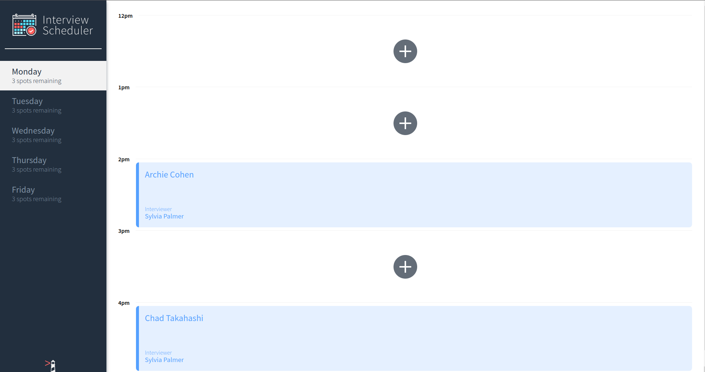
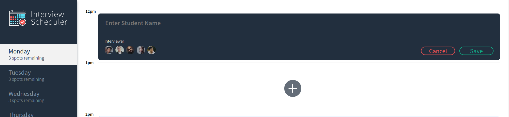
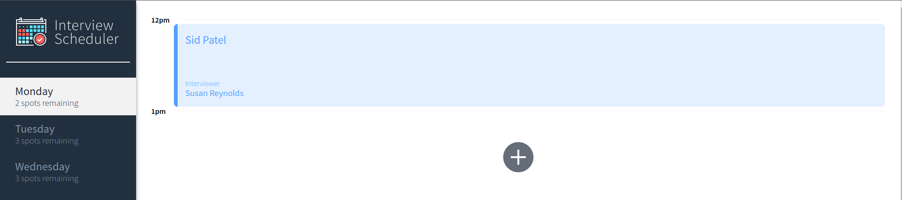

# Interview Scheduler

## Setup

Install dependencies with `npm install`.


## Project Descriptoin

This is single page React application that is used to schedlule interview appointments between students and mentors. This app has been develop with Test driven development. I have used the `jest`  library for unit testing and integration testing, and `cypress` library for end-to-end testing. The components are built and tested using `storybook` isolated environment

When you open this app, on the homescreen you can notice on left panel it list all the days and available interview spots for that day and on the right panel it shows, all the empty slots or booked interview slots.



Once you click on an empty interview slot indicated by '+' sign. You will be prompted with a form where you can fill the details of the student and interviewer.



Once the interview details and filled and confirmed, it will close the form and change the view to confirmed appointment tab



## Running Project and Tests

#### Running Webpack Development Server

```sh
npm start
```

#### Running Jest Test Framework

```sh
npm test
```

#### Running Storybook Visual Testbed

```sh
npm run storybook
```
#### Running Cypress tests

```sh
npm run cypress
```
